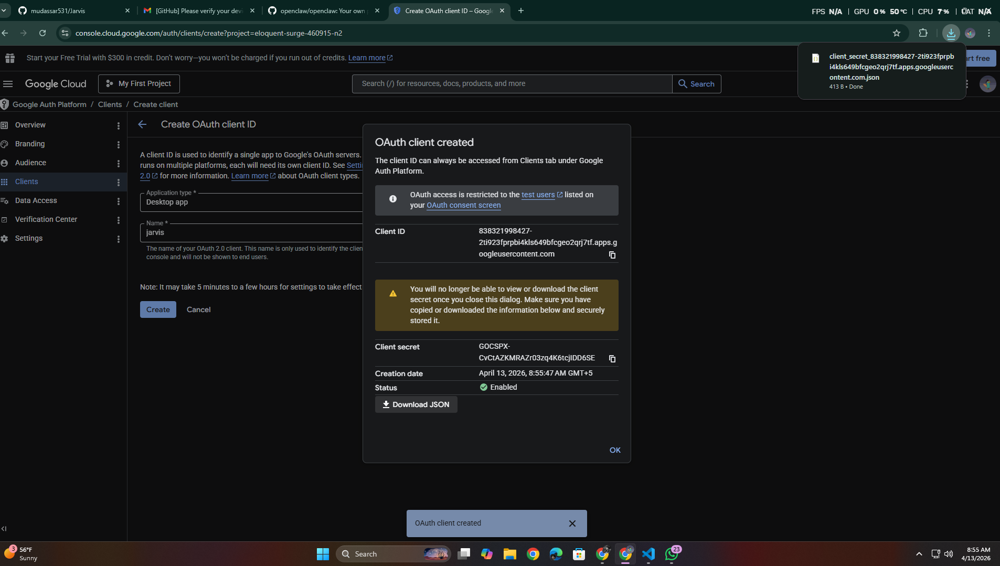

# 🤖 JARVIS — AI Voice Assistant

JARVIS is a real-time AI voice assistant for Windows that listens, thinks, and acts. It combines speech recognition, LLM reasoning, text-to-speech, and computer vision to create a hands-free desktop assistant.

**Pipeline:** Silero VAD → Deepgram STT → Gemini LLM → Kokoro TTS



---

## ✨ Features

- **Voice-to-Action (V2A)** — trigger tools by speaking naturally
- **Computer Use** — vision-based screen automation (screenshot → Gemini Vision → pyautogui)
- **Persistent Memory** — remembers conversations, user facts, and preferences across sessions
- **Context Awareness** — detects active window, time of day, and more
- **Gmail Integration** — send and read emails by voice
- **Web Search** — Brave Search or DuckDuckGo fallback
- **Floating Overlay UI** — shows LIVE / LISTENING / THINKING / SPEAKING states
- **WebSocket Server** — browser client support via FastAPI

---

## 🚀 Quick Start

### 1. Clone the Repo

```bash
git clone https://github.com/mudassar531/Jarvis.git
cd Jarvis
```

### 2. Set Up Python Environment

**Requirements:** Python 3.11+ on Windows 10/11

```bash
# Create virtual environment
python -m venv venv

# Activate it
venv\Scripts\activate

# Install all dependencies
pip install -r requirements.txt
```

> ⚠️ **PyAudio note:** If `pip install` fails on PyAudio:
> ```bash
> pip install pipwin
> pipwin install pyaudio
> ```
> Or download the `.whl` from https://www.lfd.uci.edu/~gohlke/pythonlibs/#pyaudio

### 3. Set Up API Keys

```bash
copy .env.example .env
```

Edit `.env` and fill in your keys:

| Key | Where to Get It | Notes |
|-----|----------------|-------|
| `DEEPGRAM_API_KEY` | https://console.deepgram.com | **Required** — $200 free credits |
| `GOOGLE_CREDENTIALS` | https://aistudio.google.com/app/apikey | **Required** — powers LLM + Vision |
| `BRAVE_API_KEY` | https://api.search.brave.com | Optional — 2000 queries/month free |
| `GROQ_API_KEY` | https://console.groq.com/keys | Alternative LLM (free tier) |

**Local LLM option:** Install [Ollama](https://ollama.com) then run `ollama pull qwen3:8b`

### 4. Gmail Setup (Optional)

To use email features, you need Google OAuth credentials:
1. Go to [Google Cloud Console](https://console.cloud.google.com/)
2. Create a project → Enable Gmail API
3. Create OAuth 2.0 credentials → Download as `credentials.json`
4. Place `credentials.json` in the project root
5. On first email use, a browser window will open for authorization (creates `token.json`)

### 5. Run JARVIS

**Desktop Mode (main):**
```bash
python bot.py
```
- Pick your microphone and speakers at startup
- A floating overlay appears showing status
- Just start talking!

**Server Mode (for browser clients):**
```bash
python server.py
```
- Runs on http://localhost:8080
- WebSocket at ws://localhost:8080/ws

**Stop:** Press `Ctrl+C` — conversation memory is saved automatically.

---

## 🗂️ Project Structure

```
bot.py              → Main entry point. Voice pipeline.
tools.py            → V2A tool definitions and handlers
computer_use.py     → Vision-based computer automation
memory.py           → SQLite persistent memory
context.py          → Context awareness (active window, time, etc.)
contacts.py         → Contact management
gmail_service.py    → Gmail send/read integration
ui.py               → Floating status overlay (tkinter)
server.py           → FastAPI WebSocket server
requirements.txt    → Python dependencies
.env.example        → Template for API keys
```

**Documentation:**
- `INSTRUCTIONS_FOR_FRIEND.md` — Detailed dev guide for adding V2A tools
- `VANOS_Documentation.pdf` / `vanos.pdf` — Full system documentation

---

## 🔧 Adding New V2A Tools

1. **Define schema** in `tools.py` → `get_tools()`:
```python
FunctionSchema(
    name="my_tool",
    description="What it does — be descriptive for the LLM",
    properties={
        "param1": {"type": "string", "description": "What this is for"},
    },
    required=["param1"],
),
```

2. **Add handler:**
```python
async def _my_tool(param1: str) -> str:
    # Your logic here
    return "Result that JARVIS will speak aloud"
```

3. **Add routing** in `handle_tool_call()`:
```python
elif tool_name == "my_tool":
    result = await _my_tool(tool_input["param1"])
```

4. **Test:** Run `python bot.py` and say something that should trigger your tool.

---

## 🐛 Troubleshooting

| Problem | Fix |
|---------|-----|
| "No LLM available" | Add `GOOGLE_CREDENTIALS` or `GROQ_API_KEY` to `.env` |
| PyAudio install fails | Use `pipwin install pyaudio` or download `.whl` |
| No audio detected | Check mic selection at startup, try increasing `AUDIO_GAIN` in `.env` |
| Computer use not working | Needs `GOOGLE_CREDENTIALS` (Gemini Vision) |
| "Module not found" errors | Make sure venv is activated: `venv\Scripts\activate` |
| TTS not working | Ensure `pipecat[kokoro]` installed via requirements.txt |

---

## 💡 Tool Ideas

- Clipboard read/write
- System volume control
- Window management (minimize/maximize/arrange)
- Windows toast notifications
- Timers and alarms
- Calendar integration
- Media playback control
- File search
- Git operations by voice

---

## 📄 License

This project is for personal/educational use.
